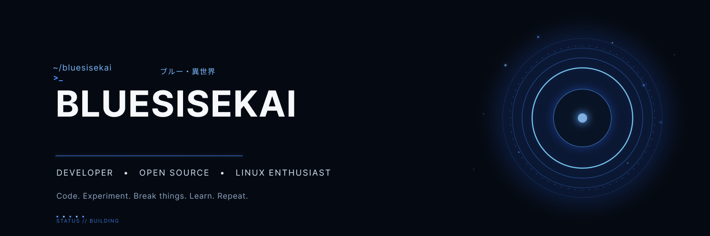

<div align="center">
  
</div>

<br>

## 🧑‍💻 About Me

```ts
const bluesisekai = {
    role: "idk, make stuff?",
    interests: ["Web", "Systems", "Open Source", "Linux"],
    environment: "Arch Linux + Hyprland",
    philosophy: "If it sounds fun, build it."
};
```

## ⚡ Tech Stack

<div align="center">

### Languages


### Web


### Tools & Platforms


</div>

## 🚀 What I'm Building

### 🐱 MeowLoad

A lightweight desktop media downloader built around **yt-dlp**, with a modern UI and zero terminal wrestling.

`Tauri` `React` `TypeScript` `yt-dlp`

## 📊 GitHub

<div align="center">


</div>

---

## 🐍 Contributions

<div align="center">

<picture>
  <source media="(prefers-color-scheme: dark)" srcset="https://raw.githubusercontent.com/BluesIsekai/BluesIsekai/output/github-contribution-grid-snake-dark.svg">
  <source media="(prefers-color-scheme: light)" srcset="https://raw.githubusercontent.com/BluesIsekai/BluesIsekai/output/github-contribution-grid-snake.svg">
  
</picture>

</div>

<div align="center">

### `Thanks for stopping by.`

<sub>Explore what I've been building ↓</sub>

</div>
